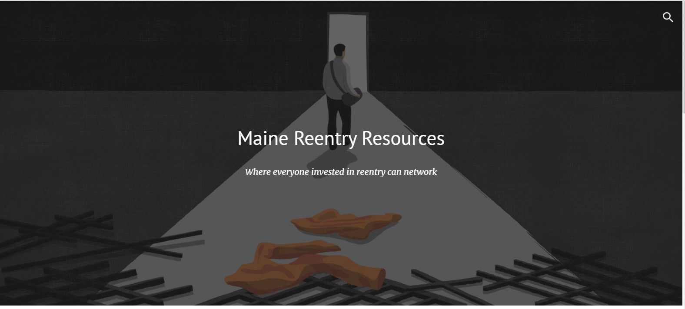
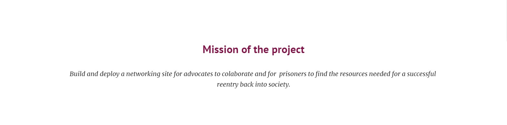
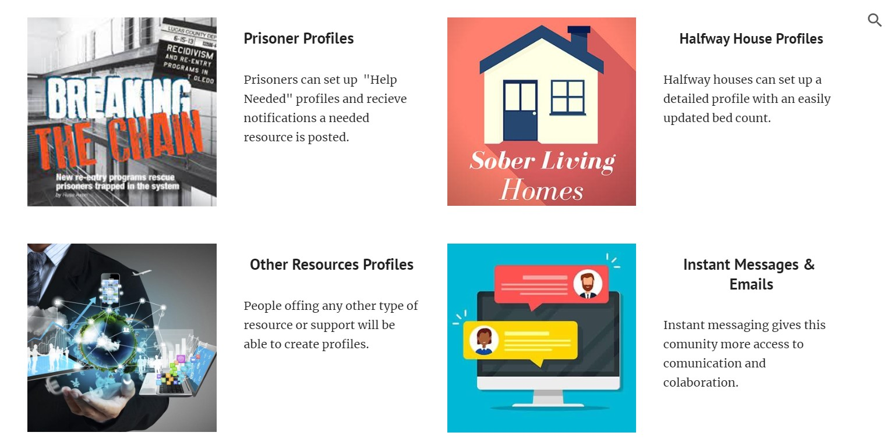

# Maine's Reentry Resources Networking Site  

***Help Wanted***

This site is being built for Maine Community of reentry advocates and/or anyone who concerns themselves with sucsesfull prisoner reintergration. [NAMI](https://www.namimaine.org/) and [MPRN](https://re-entrymaine.org/) are both non-profit orginizations that fully involved in prisoner reentry. They have agreed to maintain this site after it is launched.  

I am a Tech student / Jr Full Stack Developer. I'm hoping to find some willing developers to donate some of there time and experiance to help me build this website for a worthy cause. This website will help thousands of Maine's Prisoners have a more successful reentry back into society. 

**Also, this site can be added to your Web Developer portfolio**

 
   
# **To run this site:**
   * Click on the code button (upper right corner of repo).
   * Switch tab to codespaces
   * If there is a codespace already set up click on it.
    or click on start a codespace
   * Wait for codespace to finish loading files and setting up.
   * Click the 3-lines Icon in upper-left corner.
   * Click on terminal, then new terminal
      * In the terminal type `<npm install>` to install dependences
      * Once that has finished, type `<npm start>`
   * When you see the pop up click "Open in browser".
   * It will take a moment to load. If you see an error message   
   in new window, wait for files to finish loading in terminal and reload the new window. 
   * Click on sign in with google and enjoys exploring!

# To Contribute to this Site Build:
* In the upper right corner:
   * click the Star button.
   * Click the Fork button and save the fork to your repos.
* Open the repo in your editor of choice (This site will work on CodeSpaces and GitPod.io).
* Before you make any changes, please create and switch to a new branch off of main.
* Click on terminal, then new terminal
   * In the terminal type `<npm install>` to install dependences
   * Once that has finished, type `<npm start>`
* After you've finished making changes, commit your changes to Github.
* Make a pull request from the changes on your new branch. 

#### Styling and layout
Trying to convert layouts with React-Bootstrap   
Trying to convery Icons to React Icon Library

