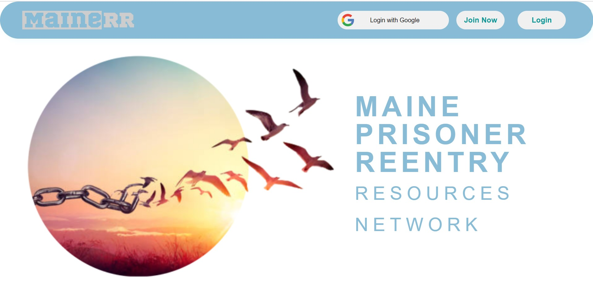
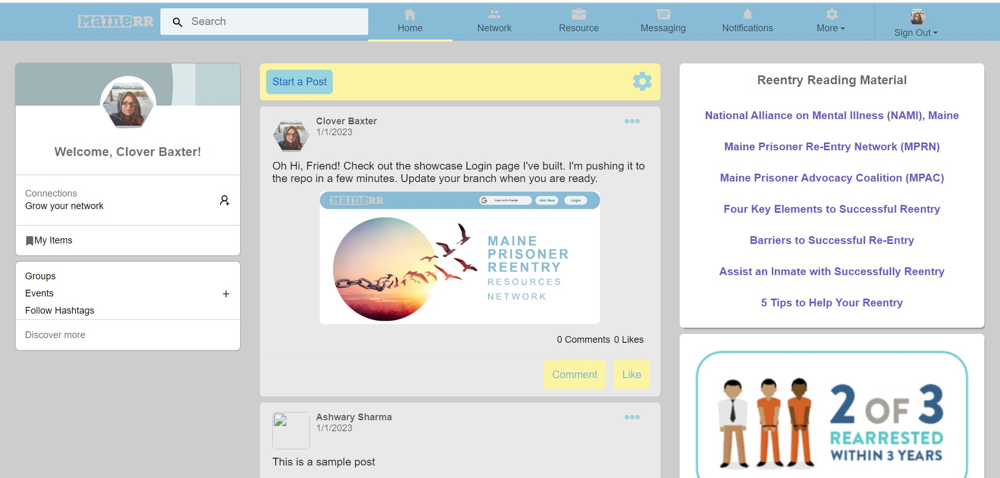

<!--- Important information shared between us collaborators:
Please add the date and your username before your comment so you can be reached if needed. Make sure your comment is 
inside the arrows so it remains hidden from everyone but us programmers. 

12/31 4-Leafs-Code: The color schema for this build are blues and grays with a touch of yellows. You do not have to use 
these colors but your choices must look well with these colors. Here are the hex #'s for quick access:   
Blues: #88bbd6 #99d3df   Grays: #cdcdcd  #e9e9e9   Yellows: #FFFDD0  #fcf4a3   Thank's for helping out!

#886724

--->

# Maine's Reentry Resources Networking Site  

**Help Wanted**
### 🌟 If you support my cause, please give this repo a star 🌟
---
***12/31/22: Notice to Everyone that has logged into this site***  

If you have loged into this site with your email, then you are stored in the database as a User. I would like to use the your user profiles to build the networking cards. Im going to wait untill 1/7/23 before I start working on the firebase rules to implament this so you have time to reach out and let me know if you would like to be excluded or erased from the database.  I need your accounts to help build and test: the networking cards, the user to user instant messaging and the message button from other pages, the resouces database and post modal, and personal profiles. I will not display anything more then your photo and your display name if you agree to let me use your account.  

You can let me know your wishes by posting a comment on the issue: [Networking cards #30](https://github.com/4-Leafs-Code/Reentry/issues/30). <= Click on these blue words for an easy redirect. 

**:notes: :fireworks: I'd like to wish everyone a Happy New Year! :fireworks: :notes:**

---

This site is being built for Maine Community of reentry advocates and/or anyone who concerns themselves with sucsesfull prisoner reintergration. [NAMI](https://www.namimaine.org/), [MPRN](https://re-entrymaine.org/) and [MPAC](https://www.maineprisoneradvocacy.org) are all non-profit orginizations that are fully involved in prisoner reentry. They have agreed to maintain this site after it is launched and spread the word as fast as possible to get every resource in the state signed up to this site. I'm estimating a 2000+ user base from day one.    

I am a Tech student / Jr Full Stack Developer. I'm hoping to find some willing developers to donate some of there time and experiance to help me build this website for a worthy cause. This website will help thousands of Maine's Prisoners have a more successful reentry back into society. 

If you would like to contribute, just comment on an issue and I will assign it to you. If you see something you would like to fix, make an issue. If you have questions or run into a problem, post your questions to the issue or under the discussions. I will help however I can. Also, please read the Contribution Guideline in the link below. When you have compleated an issue, make sure you fork is up to date with mine, and submit a pull requst. Thank you to everyone helping to make this site.

[Click Here to Read the Contribution Guideline](https://github.com/4-Leafs-Code/Reentry/blob/main/contributing.md) 

**Contributors have permission to add this site to their Web Developer portfolio after making a viable contribution.**

---
   
# **To run this site:**
   * Click the star button (upper right corner of repo).
   * Click on the code button (upper right corner of repo).
   * Switch tab to codespaces
   * If there is a codespace already set up click on it.
    or click on start a codespace
   * Wait for codespace to finish loading files and setting up.
   * Click the 3-lines Icon in upper-left corner.
   * Click on terminal, then new terminal
      * In the terminal type `npm install` to install dependences
      * Once that has finished, type `npm start`
   * When you see the pop up click "Open in browser".
   * It will take a moment to load. If you see an error message   
   in new window, wait for files to finish loading in terminal and reload the new window. 
   * Click on sign in with google and enjoy exploring!

---

